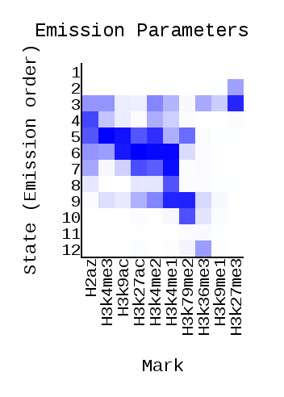
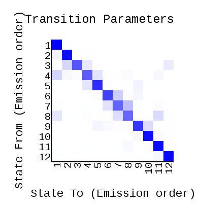
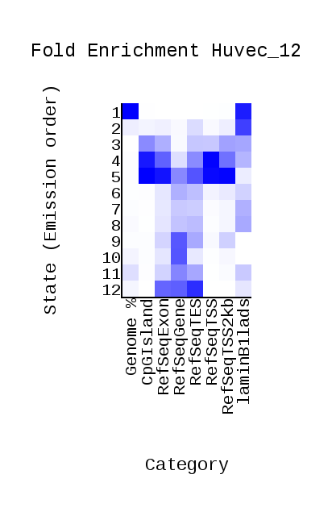
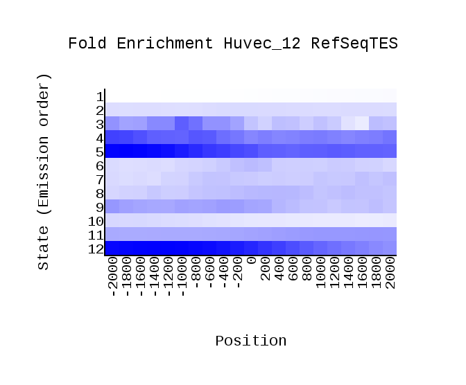
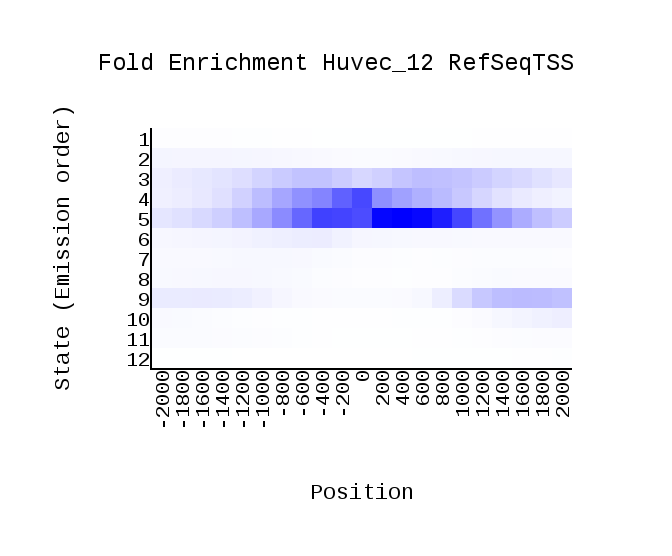
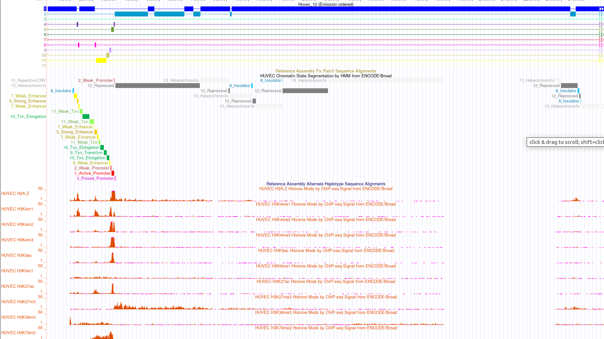

# hse_hw3_chromhmm

Ссылка на colab: https://colab.research.google.com/drive/1adQQPYY-_oYupe8h-1n6V8GOwgiwdSrY?usp=sharing

Так как в таблице c CHIP-seq эксперементами не оказалось моей клеточной линии, я взяла другую - HUVEC.

**cellmarkfiletable.txt**

| Клеточная линия  | Гистоновая метка  | Файл  | Контрльный файл  |
|---|---|---|---|
| HUVEC  | H3K27ac  | H3k27acStdAlnRep1.bam   |  ControlStdAlnRep1.bam |
| HUVEC  | H2az  | H2azAlnRep1.bam  | ControlStdAlnRep1.bam  |
| HUVEC  | H3k27me3  |  H3k27me3StdAlnRep1.bam    |  ControlStdAlnRep1.bam |
| HUVEC |  H3k36me3 |  H3k36me3StdAlnRep1.bam  | ControlStdAlnRep1.bam  |
| HUVEC  | H3k4me1  | H3k4me1StdAlnRep1.bam  |  ControlStdAlnRep1.bam |
| HUVEC  |  H3k4me2 |  H3k4me2StdAlnRep1.bam    |  ControlStdAlnRep1.bam |
| HUVEC  |  H3k4me3 |  H3k4me3StdAlnRep1.bam     |  ControlStdAlnRep1.bam |
| HUVEC  | H3k79me2  | H3k79me2AlnRep1.bam    |  ControlStdAlnRep1.bam |
| HUVEC  |  H3k9ac |  H3k9acStdAlnRep1.bam   | ControlStdAlnRep1.bam   |
| HUVEC  | H3k9me1  |  H3k9me1StdAlnRep1.bam   |  ControlStdAlnRep1.bam |

Выдача ChromHMM:

**Эпигенетические типы**

|   | Название  | Описание  |
|---|---|---|
| 1  |  Heterochromatin |  Чаще всего находятся на ядерной ламине, то есть попадает на участок репрессированного гетерохроматима |
|  2 | Heterochromatin | Выражен в H3k27m3.  Чаще всего находятся на ядерной ламине, то есть попадает на участок репрессированного гетерохроматима  |
| 3  | Repressed | Не попадает на ген   |
| 4  |  Weak enhancer/active promoter  |  Выражен в H2az, H3km1, H3k4m3, H3k4m2 |
| 5  | Active promoter  | Выражен в H2az, H3k4m1, H3k4m2, H3k4m3, H3k9ac, H3k27ac,H3k79m2  |
| 6  |  Strong enhancer | Выражен в H3k9ac, H3k27ac, H3k4m2, H3k4m1  |
| 7  |  Strong enhancer |  Выражен в H3k27ac, H3k4m2, H3k4m1 |
| 8  | Strong enhancer | Выражен в H3k4m1  |
| 9  | Weak promoter  | Выражен в H3k4m1, H3k4m2, H3k79m2  |
| 10  | Transcriptional elongation  |  Выражен в H3k79m2 |
| 11  |  Transcriptional transition/Transcriptional elongation |  Похоже, что попадает на экзон |
| 12  | Transcriptional elongation  |  Чаще всего находятся на RefSeqGene и RefSeqTES|
